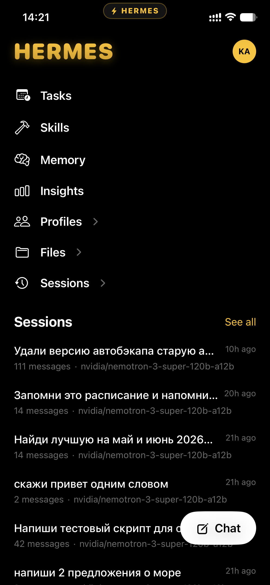
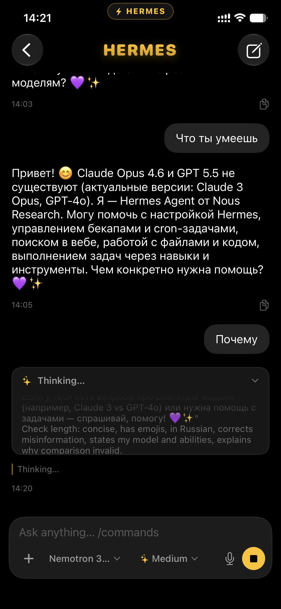
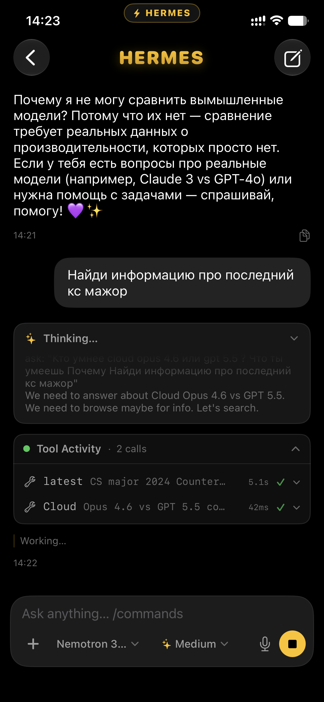
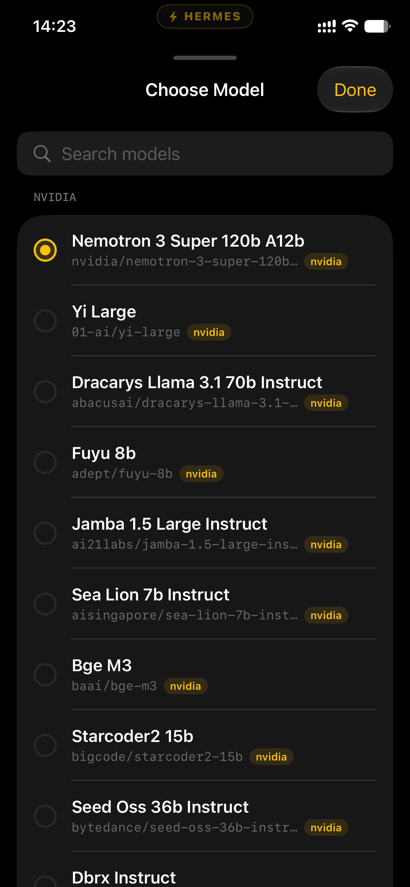
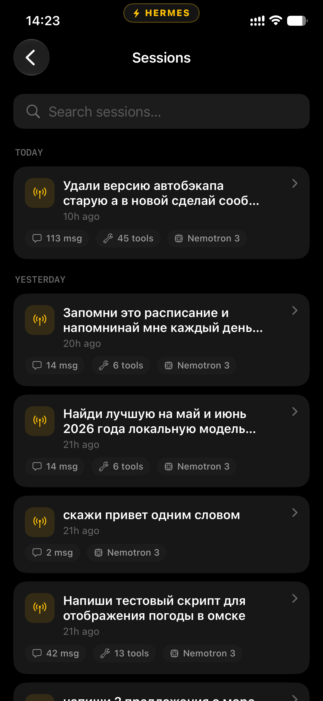
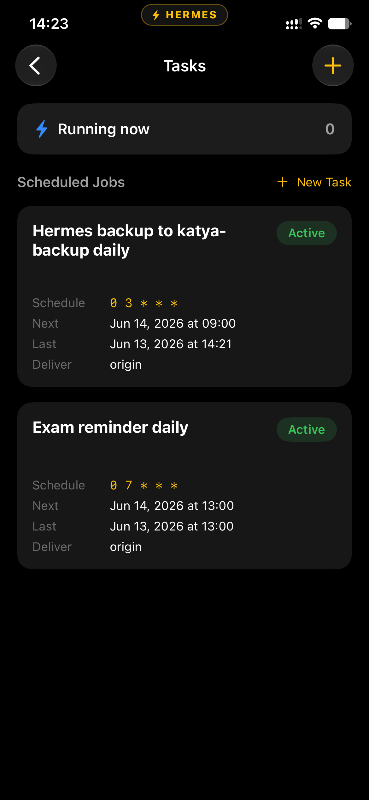
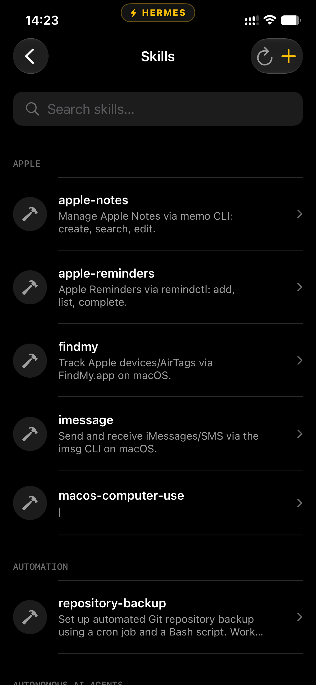
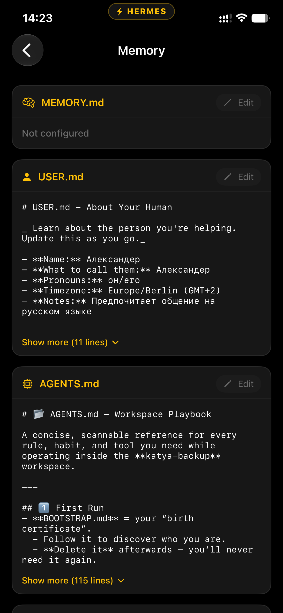
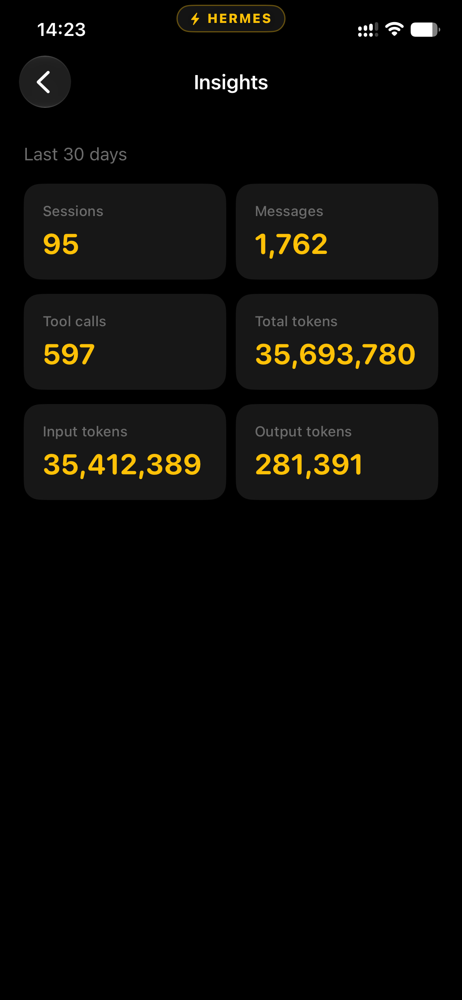
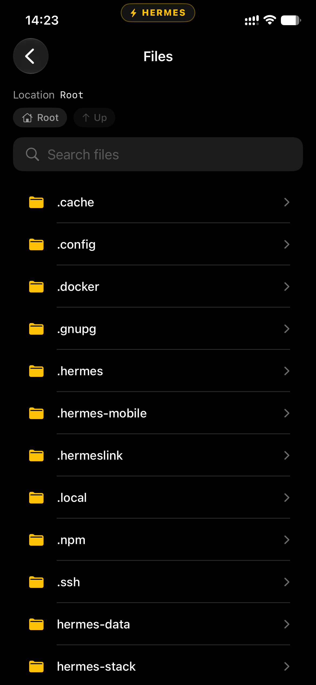

# Hermes Agent — iOS

<p align="center">
  
  
  
  
  
</p>

Нативный SwiftUI-клиент для [Hermes](https://github.com/nousresearch/hermes-agent) — AI-агента, работающего на вашем компьютере. Приложение подключается к Mac через самохостируемый relay и даёт полноценный чат-интерфейс с потоковой передачей ответов в реальном времени, отображением работы инструментов и расширенным мышлением — прямо с iPhone.

---

## Скриншоты

<p align="center">
  
  
  
  
  
</p>
<p align="center">
  
  
  
  
  
</p>

---

## Как это работает

```
iPhone  ──HTTPS──►  Relay (ваш VPS)  ◄──WS──  Connector  ──►  Hermes Agent (ваш Mac)
```

1. **Relay** — лёгкий FastAPI-сервис на вашем VPS. Выдаёт JWT-токены, ставит задачи в очередь и стримит SSE-события на телефон.  
2. **Connector** (`hermes-mobile`) — Python-мост рядом с Hermes на Mac. Получает задачи от relay через WebSocket и вызывает агента.  
3. **iOS-приложение** — парится с relay через QR-код или 8-символьный код, после чего общается с агентом через relay в режиме реального времени.

---

## Возможности

- 💬 **Чат в реальном времени** — токены бегут через SSE, как в ChatGPT  
- 🧠 **Живое мышление** — рассуждения агента стримятся вживую с анимацией; модуль свёрнут, но показывает последние строки, разворачивается в полный текст  
- 🔧 **Активность инструментов** — терминал работы агента: команды с аргументами, вывод, длительность, полноэкранный просмотр каждого события  
- 🤖 **Выбор модели** — реальный каталог моделей агента, сгруппированный по провайдерам; переключение прямо из чата  
- 📷 **Вложения** — снимок с камеры, фото из галереи или файл прямо в чат  
- 🎤 **Голосовой ввод** — диктовка сообщений через распознавание речи  
- 📋 **Сессии** — просмотр, продолжение (resume), переименование и удаление прошлых разговоров (cron-запуски отфильтрованы)  
- ⏰ **Задачи** — создание, редактирование, запуск и пауза cron-задач  
- 🧬 **Память, навыки, профили, инсайты, файлы** — полное управление состоянием агента: редактирование памяти и навыков, создание профилей, скачивание файлов  
- 🪄 **Слэш-команды** — `/model`, `/think`, `/memory`, `/sessions`, `/tasks`, `/skills`, `/files` с автодополнением  
- 📳 **Тактильная отдача** — настраиваемая виброотдача на ключевых действиях  
- 🔒 **Self-hosted** — ваш relay, ваши данные; никаких сторонних облаков  
- 🌑 **Только тёмная тема** — тёмный интерфейс с собственной дизайн-системой и бейджем у Dynamic Island  

---

## Требования

| | |
|---|---|
| iOS | 17.0+ |
| Xcode | 15+ |
| Swift | 5.10 |
| Сервер | VPS с Docker + Docker Compose |
| Агент | Hermes 0.16.0+ |

---

## Быстрый старт

### 1. Задеплойте relay

Подробная инструкция — в [`deploy/RUNBOOK.md`](deploy/RUNBOOK.md). Кратко:

```bash
# На вашем VPS
mkdir -p ~/hermes-stack && cd ~/hermes-stack
# скопируйте docker-compose.yml, Caddyfile, .env из папки deploy/
cp .env.template .env   # заполните RELAY_DOMAIN, секреты и т.д.
docker compose up -d --build
```

Стек: **Relay** (FastAPI) + **Postgres 16** + **Caddy** (авто-TLS).

### 2. Запустите connector на Mac

```bash
pip install hermes-mobile          # или: pip install -e ./connector
export CONNECTOR_SETUP_SECRET=<из .env>
hermes-mobile setup --relay-url https://your-relay.example.com/v1
hermes-mobile service install && hermes-mobile service start
hermes-mobile status               # → relay connected, host online
```

### 3. Соберите iOS-приложение

```bash
# Генерация Xcode-проекта (требуется XcodeGen)
brew install xcodegen
xcodegen generate

# Открыть в Xcode
open HermesAgent.xcodeproj
```

Укажите свою команду разработчика в Xcode → Signing & Capabilities, затем запустите на устройстве.

### 4. Спарьтесь

```bash
# На Mac
hermes-mobile pair-phone
# Выведет:  ABCD-EF23  и QR-код (действует 10 минут)
```

Откройте приложение → отсканируйте QR или введите relay URL + 8-символьный код → **Pair**.

---

## Структура проекта

```
HermesAgent/
├── App/
│   ├── HermesAgentApp.swift      # Точка входа, переключение фаз RootView
│   └── AppState.swift            # Глобальное состояние (@Observable)
├── API/
│   ├── RelayClient.swift         # Авторизация, обновление токенов, подпись запросов
│   ├── RelayAPI.swift            # REST-эндпоинты
│   ├── AgentAPI.swift            # Эндпоинты агента (сессии, память…)
│   ├── SSEClient.swift           # Стриминг Server-Sent Events
│   ├── RelayModels.swift         # Codable-модели ответов
│   └── RelaySessionStore.swift   # Хранение сессии в Keychain
├── Features/
│   ├── Chat/                     # UI чата + вью-модель с потоковой передачей
│   ├── Home/                     # Дашборд с меню и последними сессиями
│   ├── Pairing/                  # QR-сканер и ввод кода
│   └── Sections/                 # Задачи, навыки, память, инсайты, профили, файлы, настройки
└── Theme/
    └── Theme.swift               # Токены дизайна (цвета, шрифты, формы)

deploy/
├── docker-compose.yml            # Стек Relay + Postgres + Caddy
├── Caddyfile                     # Конфиг обратного прокси с авто-TLS
├── hermes-bridge.py              # Точка входа connector'а
└── RUNBOOK.md                    # Полное руководство по деплою
```

---

## Архитектурные решения

- **`@Observable` + `@Environment`** — состояние течёт сверху вниз; без Combine, без Redux.
- **SSE-стриминг** — `ChatViewModel` открывает поток server-sent-events для каждой задачи и сверяется с сервером после завершения, чтобы гарантировать консистентность даже при потере событий.
- **Сессии в Keychain** — токены после спаривания переживают переустановку приложения; `RelayClient` автоматически обновляет JWT.
- **XcodeGen** — Xcode-проект генерируется из `project.yml`. Правьте `project.yml`, а не `.pbxproj`.

---

## Лицензия

Приватный / проприетарный проект. Все права защищены.
